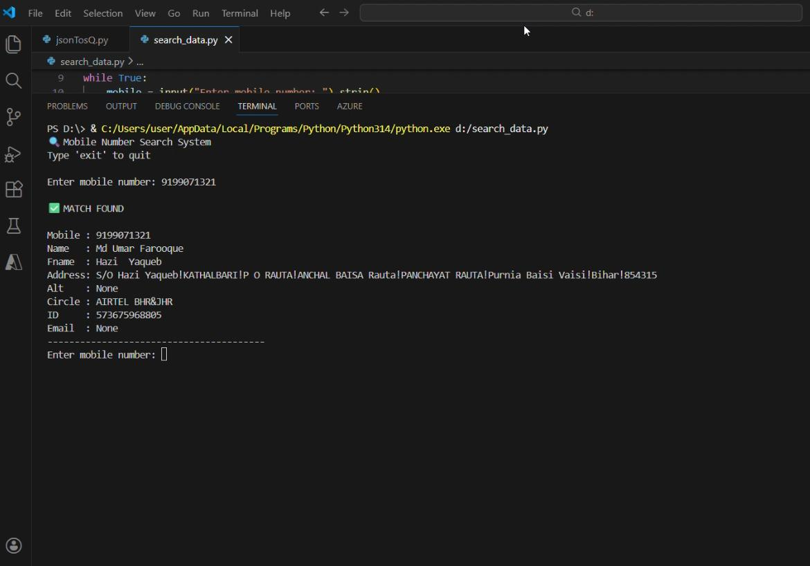

# Large-Scale User Data Processing & Search System

A real-world **data engineering project** focused on processing, transforming, and searching an extremely large JSON dataset (~466 GB) using **Python** and **SQLite**.

This project demonstrates how to design a **fault-tolerant, memory-efficient, and high-performance data ingestion pipeline** capable of running for multiple days and safely recovering from crashes.

---

## 📌 Project Overview

In real-world scenarios, organizations and investigative teams often work with **massive semi-structured datasets** that are difficult to process and query efficiently.

This project addresses that challenge by converting a **466 GB JSON dataset** into a structured relational database and enabling **fast indexed search**.

---

## 🎯 Objectives

- Process a **very large JSON dataset (~466 GB)** without loading it into memory
- Convert semi-structured JSON data into a relational SQLite database
- Handle long-running execution (4–5 days) with crash recovery
- Enable fast lookup using indexed fields (e.g., phone number)
- Demonstrate real-world data engineering challenges and solutions

---

## 🧠 Key Challenges Solved

- ❌ Memory limitations while handling huge files  
- ❌ Script crashes during multi-day execution  
- ❌ Risk of data loss on restart  
- ❌ Slow database insert performance  

✅ Solved using streaming ingestion, batching, checkpointing, and database optimization.

---

## 🛠️ Tech Stack

- **Programming Language:** Python  
- **Database:** SQLite  
- **Library:** `ijson` (for streaming JSON parsing)

---

## ⚙️ System Design & Workflow

1. Stream records from a large JSON file using `ijson` (no full file loading)
2. Insert records into SQLite using **batch commits** for performance
3. Optimize SQLite using:
   - WAL mode
   - PRAGMA tuning
4. Track progress using a **checkpoint / resume mechanism**
5. Automatically resume from the last processed record after a crash
6. Enable fast lookup using indexed primary keys

---

## 🗃️ Database Schema

```sql
CREATE TABLE users (
    mobile TEXT PRIMARY KEY,
    name TEXT,
    fname TEXT,
    address TEXT,
    alt TEXT,
    circle TEXT,
    id TEXT,
    email TEXT
);

## 📸 Project Screenshots

### Dataset Processing Output


> **Note:** Screenshots are for demonstration purposes only.  
> Sensitive information has been anonymized or blurred.


